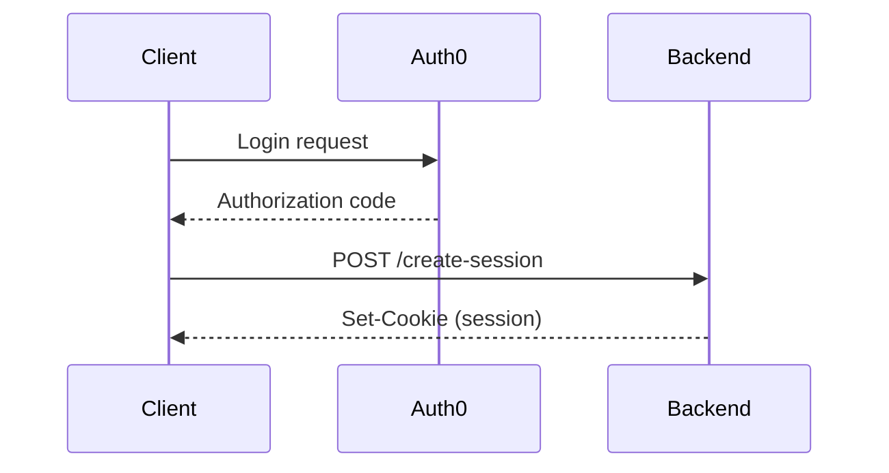
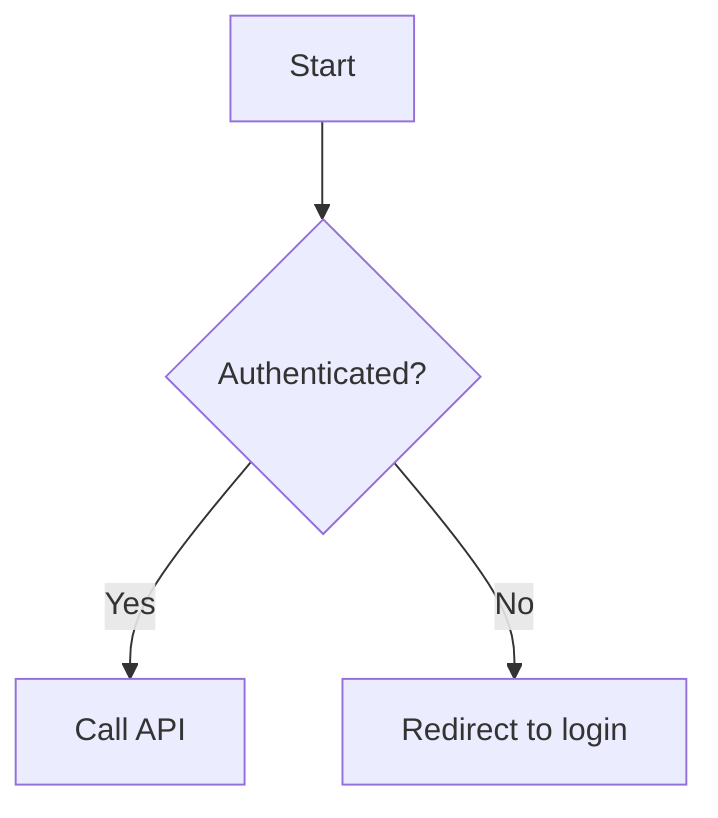
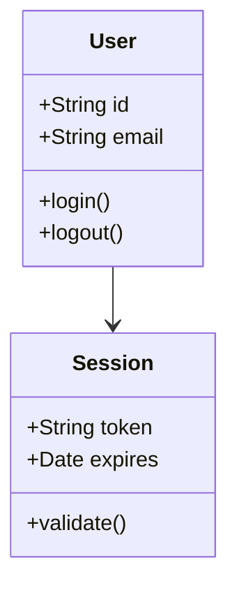
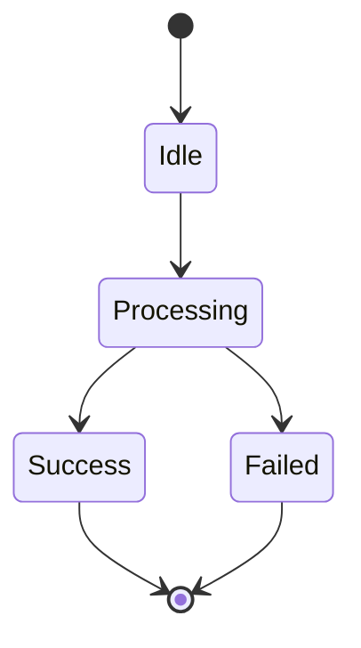
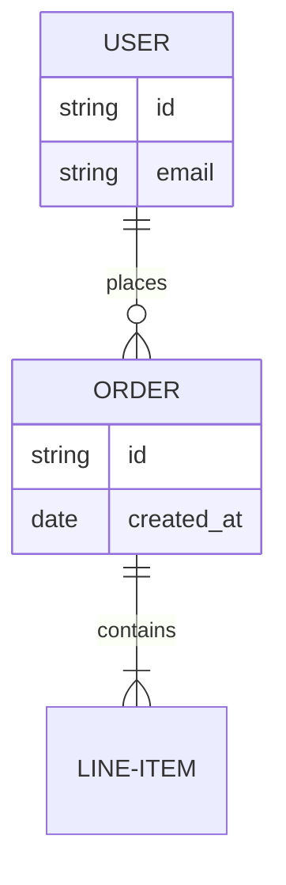

# Mermaid Generator

Generate valid, error-free Mermaid diagrams following strict syntax rules and best practices.

## Core Principles

1. **NO HTML tags** - Never use `<br/>`, `<br>`, or any HTML in any part of the diagram
2. **NO style directives** - Never use `style`, `fill`, `stroke`, `classDef`, or color specifications
3. **Simple labels** - Keep text concise, avoid special characters or escape them properly
4. **Validate syntax** - Always check against common error patterns before finalizing

## Quick Start

When generating any Mermaid diagram:

1. Identify the diagram type (sequence, flowchart, class, state, ER)
2. Use only the patterns from [syntax-guide.md](references/syntax-guide.md)
3. Avoid all forbidden patterns listed below
4. Keep labels short and simple

## Forbidden Patterns

These ALWAYS cause errors - never use:

```mermaid
❌ participant User<br/>Browser          (HTML tags)
❌ A[Label<br/>with breaks]              (HTML in labels)
❌ style A fill:#ff0000                  (Style directives)
❌ classDef myClass fill:#f9f            (Color definitions)
❌ A --> B: Very long message<br/>text   (Line breaks in text)
```

## Safe Patterns

Use these instead:

```mermaid
✅ participant UserBrowser as User Browser    (Aliases)
✅ A[Short label]                             (Concise text)
✅ A --> B: Concise message                   (Single-line text)
✅ Note over A,B: Descriptive note            (Notes for details)
```

## Diagram Type Selection

Choose based on use case:

- **Sequence diagrams**: Authentication flows, API calls, time-based interactions
- **Flowcharts**: Decision logic, processes, algorithms, step-by-step workflows
- **Class diagrams**: Object-oriented design, data structures, type hierarchies
- **State diagrams**: State machines, status lifecycles, transition logic
- **ER diagrams**: Database schemas, entity relationships, data models

## Generating Diagrams

### Sequence Diagrams

Use for showing interactions over time (auth flows, API calls):



**Key rules:**
- Use `participant X as Long Name` for readable labels
- Arrow types: `->`, `-->`, `->>`, `-->>` (solid/dotted, with/without arrow)
- Keep messages concise (no line breaks)
- Use `Note over X,Y: Text` for additional context

See [syntax-guide.md](references/syntax-guide.md) for complete sequence diagram syntax.

### Flowcharts

Use for decision trees and processes:



**Key rules:**
- Direction: `TD` (top-down), `LR` (left-right), `BT` (bottom-top), `RL` (right-left)
- Shapes: `[]` rectangle, `()` rounded, `{}` diamond, `[[]]` subroutine
- Use quotes for labels with special chars: `A["Label: special"]`

See [syntax-guide.md](references/syntax-guide.md) for complete flowchart syntax.

### Class Diagrams

Use for object-oriented design:



**Key rules:**
- Visibility: `+` public, `-` private, `#` protected
- Relationships: `<|--` inheritance, `*--` composition, `-->` association
- Keep type annotations simple

See [syntax-guide.md](references/syntax-guide.md) for complete class diagram syntax.

### State Diagrams

Use for state machines and lifecycles:



**Key rules:**
- Use `stateDiagram-v2` (v2 is current version)
- `[*]` represents start/end states
- Avoid special characters in state names

See [syntax-guide.md](references/syntax-guide.md) for complete state diagram syntax.

### ER Diagrams

Use for database schemas:



**Key rules:**
- Cardinality: `||--||` one-to-one, `||--o{` one-to-many, `}o--o{` many-to-many
- Use hyphens in multi-word entity names: `USER-ACCOUNT`
- Keep attribute types simple

See [syntax-guide.md](references/syntax-guide.md) for complete ER diagram syntax.

## Error Prevention Workflow

Before finalizing any Mermaid diagram:

1. **Check for HTML tags** - Search for `<br`, `<div`, or any `<` character
2. **Check for style directives** - Search for `style`, `fill:`, `stroke:`
3. **Check labels** - Ensure all text is concise (no manual line breaks)
4. **Check special chars** - Escape or quote labels with `:`, `#`, `{}`, `[]`, `()`
5. **Verify syntax** - Match exactly against patterns in syntax-guide.md

## Common Fixes

| Error Pattern | Fix |
|--------------|-----|
| `participant A<br/>B` | `participant AB as A B` |
| `A->>B: Long<br/>text` | `A->>B: Long text` (keep single line) |
| `style A fill:#f00` | Delete entirely (no styling) |
| `A[Label #1]` | `A["Label #1"]` (quote special chars) |
| `A --> B: text<br/>more` | Split into two arrows or use Note |

## Resources

### references/syntax-guide.md

Comprehensive syntax reference with:
- Detailed syntax for all diagram types
- Common pitfalls with examples
- Validation checklist
- Quick reference for diagram type selection

Load this file when encountering syntax questions or edge cases.
