# Mermaid Syntax Guide

## Common Syntax Rules (ALL Diagram Types)

### Critical Rules to Avoid Errors

1. **NO HTML tags in text** - Never use `<br/>`, `<br>`, or any HTML
   - ❌ `participant User<br/>Browser`
   - ✅ `participant UserBrowser as User Browser`

2. **Line breaks in labels** - Use escaped newlines or avoid them
   - ❌ Multi-line text with `<br/>`
   - ✅ Use short, single-line labels

3. **Special characters** - Escape or avoid: `#`, `{`, `}`, `[`, `]`, `(`, `)`
   - ❌ `A[Label with (parentheses)]`
   - ✅ `A[Label with parentheses]`

4. **NO style/color directives** (per CLAUDE.md)
   - ❌ `style A fill:#ff0000`
   - ❌ `classDef myClass fill:#f9f,stroke:#333`
   - ✅ Use default styling only

5. **Quotes** - Use for labels with special characters
   - `A["Label with: special chars"]`

## Sequence Diagrams

### Basic Syntax

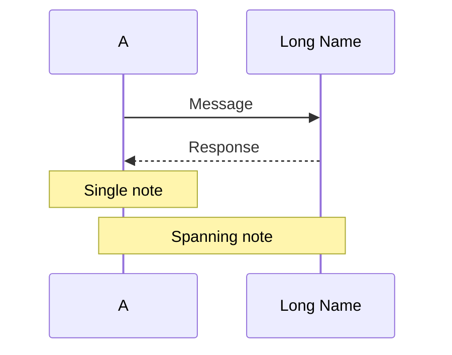

### Arrow Types

- `->` Solid line without arrow
- `-->` Dotted line without arrow
- `->>` Solid line with arrow
- `-->>` Dotted line with arrow

### Common Pitfalls

❌ **Don't use br tags in participant names:**
```mermaid
participant Auth0<br/>Server
```

✅ **Use aliases instead:**
```mermaid
participant Auth0 as Auth0 Server
```

❌ **Don't use br in messages:**
```mermaid
A->>B: POST /token<br/>{ code: "..." }
```

✅ **Keep messages concise:**
```mermaid
A->>B: POST /token (code parameter)
```

### Advanced Features

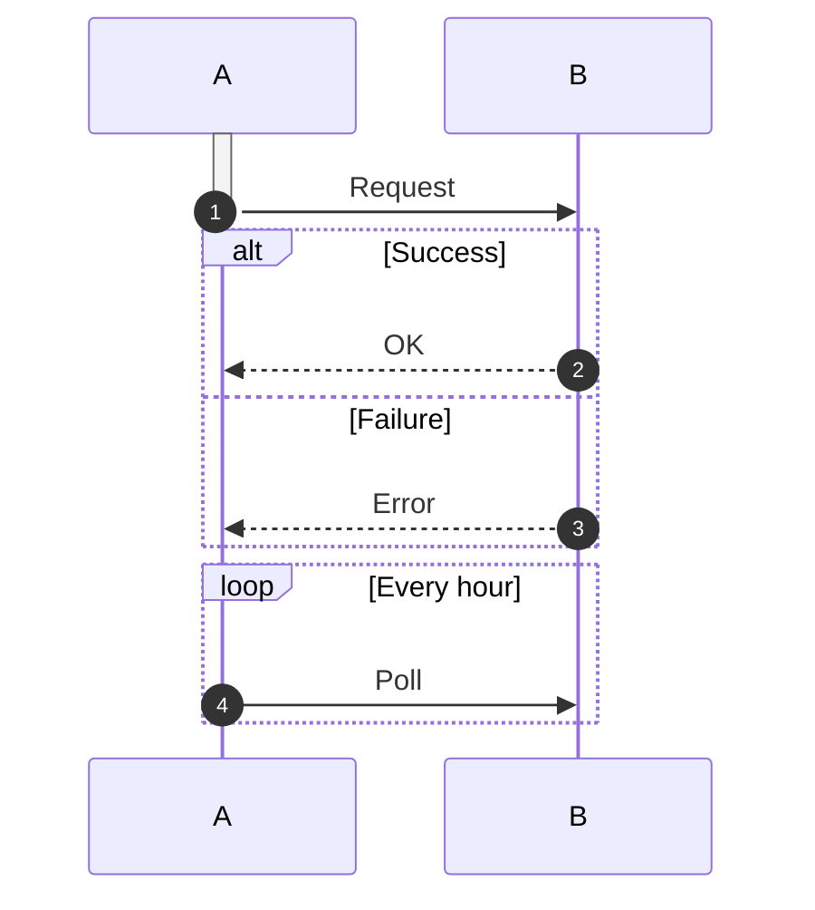

## Flowcharts

### Basic Syntax

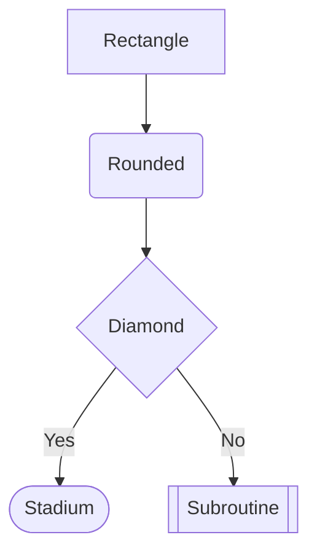

### Direction Options

- `TD` or `TB` - Top to bottom
- `BT` - Bottom to top
- `LR` - Left to right
- `RL` - Right to left

### Common Pitfalls

❌ **Don't use complex labels:**
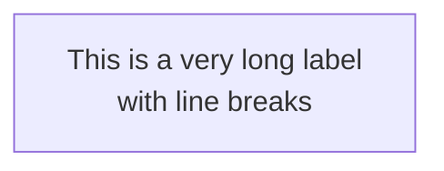

✅ **Keep labels short:**
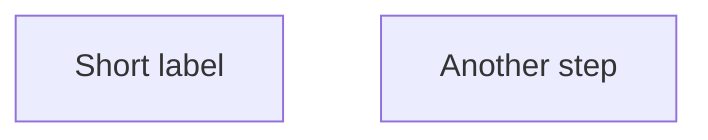

❌ **Don't use special chars unescaped:**
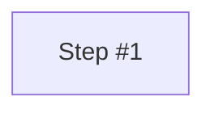

✅ **Use quotes for special chars:**


## Class Diagrams

### Basic Syntax

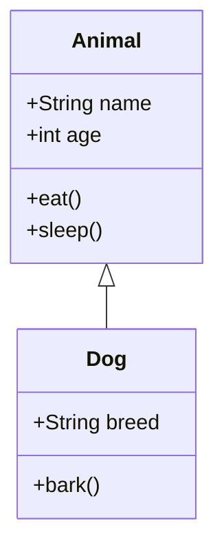

### Relationship Types

- `<|--` Inheritance
- `*--` Composition
- `o--` Aggregation
- `-->` Association
- `--` Link (solid)
- `..>` Dependency
- `..|>` Realization

### Visibility Modifiers

- `+` Public
- `-` Private
- `#` Protected
- `~` Package/Internal

### Common Pitfalls

❌ **Don't use complex type annotations:**
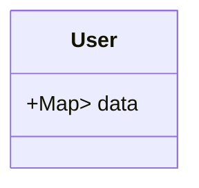

✅ **Simplify types:**
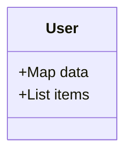

## State Diagrams

### Basic Syntax

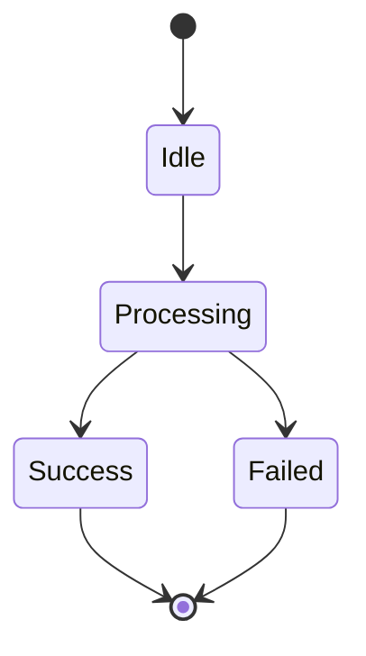

### Composite States

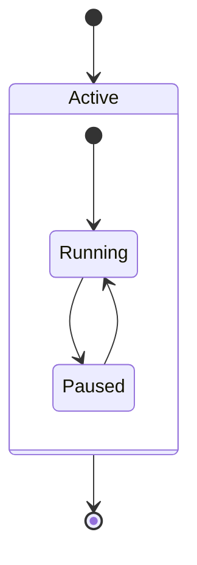

### Common Pitfalls

❌ **Don't use special chars in state names:**
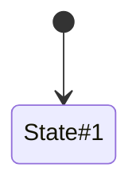

✅ **Use alphanumeric names:**
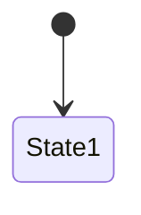

## Entity Relationship Diagrams

### Basic Syntax

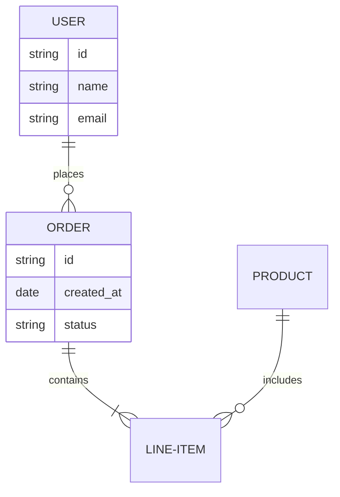

### Relationship Cardinality

- `||--||` One to one
- `||--o{` One to many
- `}o--o{` Many to many
- `||--|{` One to exactly one

### Common Pitfalls

❌ **Don't use spaces in entity names:**
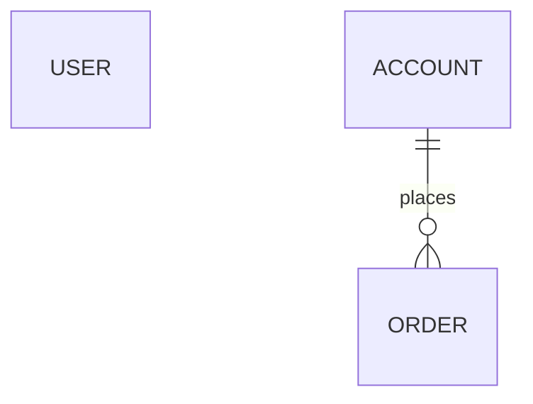

✅ **Use hyphens or camelCase:**
```mermaid
erDiagram
    USER-ACCOUNT ||--o{ ORDER : places
```

## Validation Checklist

Before finalizing a Mermaid diagram, verify:

- [ ] No `<br/>` or HTML tags anywhere
- [ ] No `style`, `fill`, or `stroke` directives
- [ ] All participant/node names are simple (no special chars)
- [ ] Line breaks are avoided or properly escaped
- [ ] Quotes used for labels with special characters
- [ ] Diagram type matches user requirements
- [ ] Syntax follows the exact patterns above

## Quick Reference: When to Use Each Diagram Type

- **Sequence**: Time-based interactions, API flows, authentication flows
- **Flowchart**: Decision trees, processes, algorithms
- **Class**: Object-oriented design, data structures
- **State**: State machines, lifecycle management
- **ER**: Database schemas, data relationships
